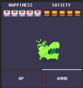
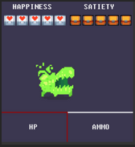
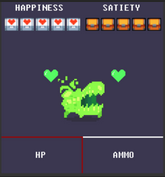
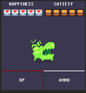

# APPPLICATION NOTE
## Student: s317856 Discolo Lorenzo
## CUDDLE ANIMATION  

In questo progetto è stata utilizzata la development board LandTiger V2.0 NXP LPC1768 su cui è

stato montato un modulo 3.2’’ Touch Screen TFT LCD gestito dal LCD controller ILI9325 e il touch

screen controller ADS7843. Quest’ultimo è stato utilizzato all’interno del progetto per permettere

all’utente finale di poter attivare, attraverso un tocco sul personaggio, un’animazione chiamata

“cuddle animation”. Il controllo dell’eventuale tocco sullo schermo nell’area prestabilita è stato

demandato al RIT che con una cadenza pari a 25ms andrà a verificare inizialmente lo stato di due

flag, “select\_joystick” e “cuddle”, e poi l’effettivo tocco da parte dell’utente. Il primo flag è

necessario affinchè l’animazione cuddle non entri in conflitto con l’attivazione di altre animazioni

possibili nel gioco attraverso l’input di altre periferiche. Invece, il controllo del secondo flag evita

l’attivazione multipla e seriale dell’animazione in seguito ad un tocco ripetuto da parte dell’utente.

Per poter deliniare un’area precisa dello schermo, corrispondente al personaggio, è stato utilizzato

un’istruzione if in cui è presente questa seguente condizione:

*(((display.x > HORROR00\_position.Xpos) && (display.x < HORROR00\_position.Xpos +*

*HORROR00.width)) && ((display.y > HORROR00\_position.Ypos) && (display.y <*

*HORROR00\_position.Ypos+HORROR00.height))).*

HORROR00\_position.Xpos e HORROR00\_position.Xpos sono le coordinate del personaggio sullo

schermo. HORROR00.width e HORROR00.height sono rispettivamente la larghezza e l’altezza del

personaggio sullo schermo. Soddisfatte queste condizioni verrà settata la flag “cuddle” ad 1,

resettato e inizializzato il TIMER1 con ritardo di 500ms e infine abilitato. Dopo 500ms verrà

lanciata un’interruzione del TIMER1 e grazie al flag “cuddle” eseguità la funzione

“animation\_cuddle()”. Il flusso del programma entrerà 4 volte in questa funzione in modo tale da

poter far visualizzare i quattro diversi frame che caratterizzano l’animazione di 2 secondi. Questo

viene fatto grazie ad una variabile locale definita nella funzione chiamata “animation”.

Nella funzione “animation\_cuddle()” inizialmente verrà disabilitato il TIMER0 in modo da impedire

l’attivazione di altre animazioni. In seguito, in base alla variabile “animation” verrà scelta la

sezione da eseguire. La prima sezione disegna un rettangolo con lo stesso colore dello sfondo di

dimensioni pari a quelle del personaggio così da eliminarlo dallo schermo. Andando poi a

disegnare il personaggio spostato di 20 pixel verso destra. Le altre 2 sezioni seguono la stessa

logica andando a spostare il personaggio a sinistra e successivamente al centro dello schermo

facendo comparire infine dei cuori sopra a quest’ultimo. Nell’ultima sezione vengono azzerate le

variabili “animation”e “cuddle”, abilitato il TIMER0, aumentato l’indicatore “HAPPINESS” un’unità,

incrementato il tempo di un secondo e rinizializzato il TIMER1 a 5 secondi poiché nel caso di

cuddle pari a 0 gestisce l’eliminazione periodica degli elementi “HAPPINESS” e “SATIETY”.

## Screenshot

